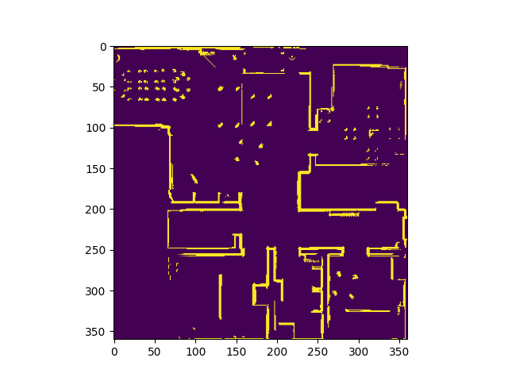
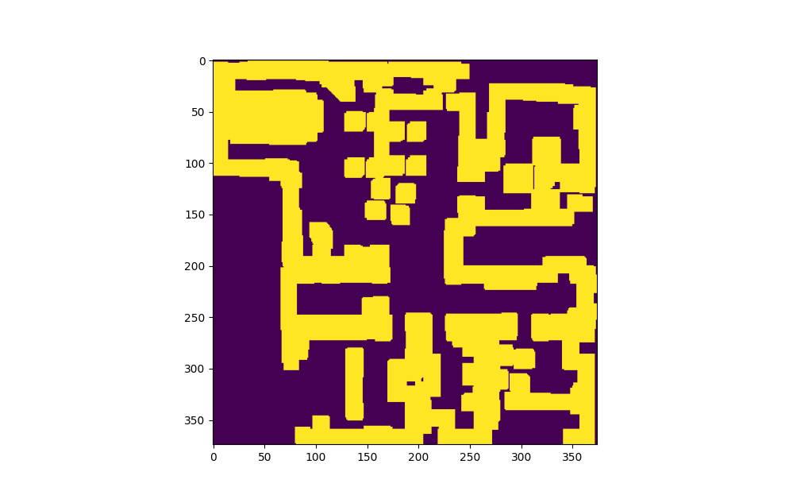

# LIDAR Mapping and Path Planning with Tiago Robot
This project implements a robot navigation system using the Tiago robot platform in Webots, featuring LIDAR-based mapping, configuration space computation, path planning algorithms, and autonomous navigation.

## Project Status
### Current Status: In Progress
- ✅ LIDAR-based occupancy grid mapping implemented and functioning
- ✅ Probability-based mapping with grayscale representation working
- ✅ Configuration space computation through convolution implemented
- 🔄 Path planning algorithm (A*) implementation in progress
- ⬜ Autonomous navigation controller still needs implementation
- ⬜ Pick and place functionality not yet implemented

## Project Structure

```
Lab 5/
├── controllers/                # Tiago robot controllers
│   ├── lab5_controller2/
│   │   ├── lab5_controller2.py # main controller file
│   │   └── map.npy             # map obtained by our manual LIDAR scan after filtering
│   └── lab5_joint/
├── images/
│   ├── CSpace.png
│   └── LIDAR_Map.png
├── worlds/     # Webots world files
└── ...         # misc files
```

## Example Generated Maps



The image above shows our robot's generated occupancy grid map of the environment using LIDAR data. White areas represent free space, while darker pixels indicate detected obstacles.

 

The image above shows the configuration space after dilating obstacles to account for the robot's physical dimensions. This ensures paths maintain safe distances from obstacles.

## Technical Components

### 1. Mapping System
- LIDAR-based occupancy grid mapping in real-time
- Probabilistic sensor model with grayscale representation
- Map filtering and saving capabilities
- Coordinate transformation from robot to world frame

### 2. Configuration Space Computation
- Dilation of obstacles using convolution
- Binary thresholding for obstacle classification
- Ensures planned paths keep safe distance from obstacles

### 3. Path Planning
- Implementation of graph search algorithms (A* or Dijkstra's)
- Conversion between world coordinates and map coordinates
- Generation of waypoints for robot navigation
- Visualization of planned paths

### 4. Feedback Controller
- Proportional control for waypoint navigation
- Error calculation for distance and heading
- Smooth velocity adjustments
- Wheel speed normalization

## Operation Modes

### 1. Manual Mode
- Direct control of robot through keyboard input
- Real-time mapping during manual exploration
- Saving/loading map functionality

### 2. Planner Mode
- Loads saved map from disk
- Computes configuration space
- Plans path between specified start and goal points
- Saves planned path for autonomous execution

### 3. Autonomous Mode
- Loads pre-planned path
- Navigates through waypoints using feedback controller
- Real-time obstacle detection and avoidance

### 4. Pick and Place Mode
- Advanced mode combining navigation with manipulation
- Path planning to reach objects
- Robot arm control for pick and place operations

## Implementation Details

The system implements a complete perception-planning-action loop:

1. **Perception**: LIDAR data is processed to create and update an occupancy grid map
2. **Planning**: Configuration space is computed and paths are planned using search algorithms
3. **Action**: Robot navigates through waypoints using a feedback controller

The map is represented as a 360×360 grid corresponding to a 12×12 meter environment, with each pixel representing a 3.33×3.33 cm area.

## Usage Instructions

1. Select operation mode by modifying the `mode` variable:
   ```python
   mode = 'manual'      # For manual control and mapping
   mode = 'planner'     # For path planning
   mode = 'autonomous'  # For autonomous navigation
   mode = 'picknplace'  # For pick and place operations